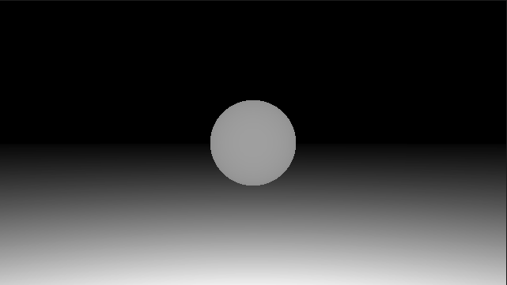
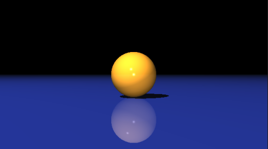
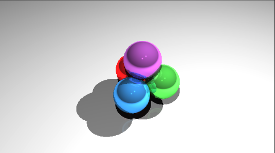
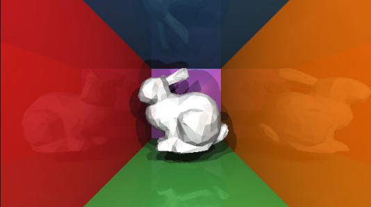
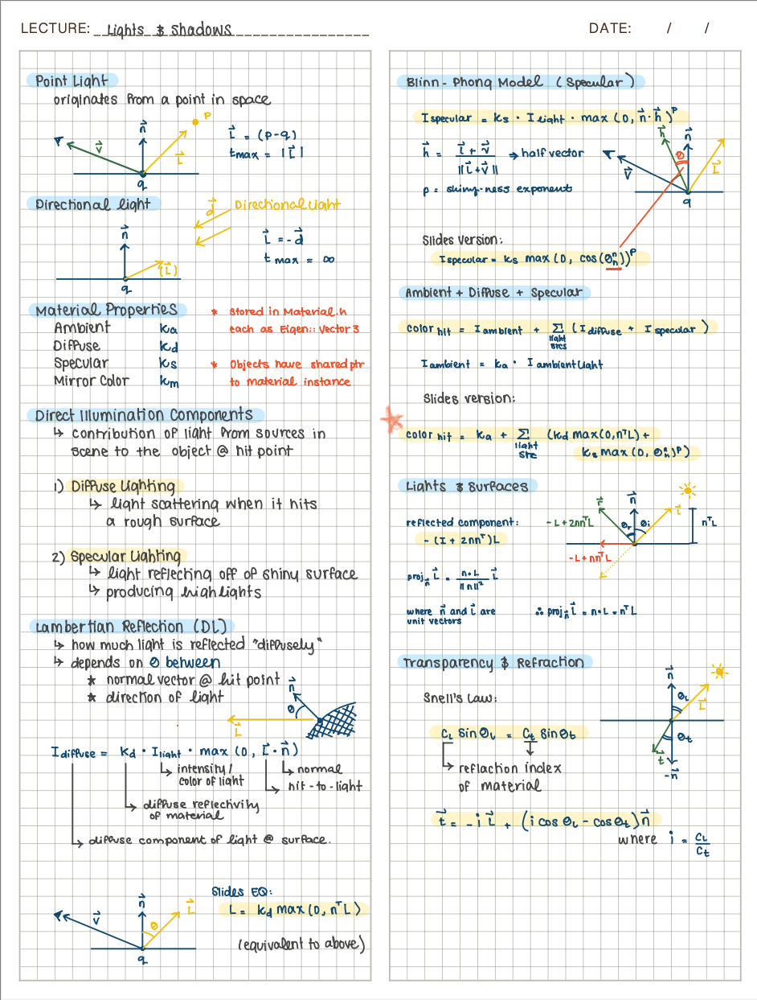

# Computer Graphics – Ray Tracing

**Source**: This repository was created by @alecjacobson for an offering of csc317 Computer Graphics at the University of Toronto.

> The original repository can be found at:
>
> http://github.com/alecjacobson/computer-graphics-ray-tracing.git

## Overview
This repository implements a complete ray tracer. The ray tracer is capable of rendering scenes with shadows, reflections, and refractions. The ray tracer is implemented in C++ and uses the Eigen library for linear algebra.

## Object Intersection
The first step towards a ray tracer is to implement ray intersection with primitives. This was implemented in the [previous assignment](https://github.com/StellaZare/ray-casting) and re-used in this repository. 

When generating rays to render an image, the ray tracer casts a ray from the camera through each pixel in the image plane. The file `src/viewing_ray.cpp` contains the implementation for generating rays from the camera through each pixel in the image plane.

To determine how a given ray intersects the objects in the scene, the ray tracer uses the first hit algorithm. The implementation for the first hit algorithm can be found in `src/first_hit.cpp`.

The ray tracer supports spheres, planes, and triangles as primitives. The implementation for each primitive can be found in the `src/` directory.
- `src/Sphere.cpp`
- `src/Plane.cpp`
- `src/Triangle.cpp`

The ray tracer also supports a collection of triangles, which can be used to represent more complex shapes. The implementation for the triangle soup can be found in `src/TriangleSoup.cpp`.

At this stage, the images generated are simple and lack realistic lighting, which makes them appear flat.

<table>
  <tr>
    <td></td>
    <td></td>
    <td></td>
  </tr>
</table>

## Lights and Shadows
The ray tracer supports both point lights and directional lights. For each light source type, the directionality of the ray from the point of intersection to the light source is determined using the member function `direction` in the respective light source class. The implementation for the `direction` member function can be found in the following files:
- `src/PointLight.cpp`
- `src/DirectionalLight.cpp`

The ray tracer accounts for shadows by casting a ray from the intersection point to each light source. If the ray intersects with an object before reaching the light source, the point is in shadow and the light source does not contribute to the color of the point.

To determine the color of a given point in the scene, the ray tracer accounts for the contributions of all light sources in the scene using the Blinn-Phong reflection model. The implementation for the Blinn-Phong model can be found in `src/PhongMaterial.cpp`.

## Reflections
The ray tracer supports reflections by recursively casting rays in the direction of the reflected ray. To do this, first we need to determine the directionality fo the reflected rays. The implementation for the this can be found in `src/reflect.cpp`.

The next step is recursively casting rays in the direction of the reflected ray and add their contribution to the final color of the point. 

## Ray Color
The bulk of the ray tracing process is implemented in `src/raycolor.cpp`. This function uses the first hit algorithm to determine the closest intersection of the ray with the objects in the scene. It then computes the color of the point by accounting for the contributions of all visibile light sources using the Blinn-Phong model. Lastly, it recursively casts rays in the direction of the reflected ray to account for reflections.

## Results
The results of the ray tracing process are images that are more realistic and visually appealing.

 

`sphere-and-plane.ppm`

 `sphere-packing.ppm`

`bunny.ppm`

## Notes

